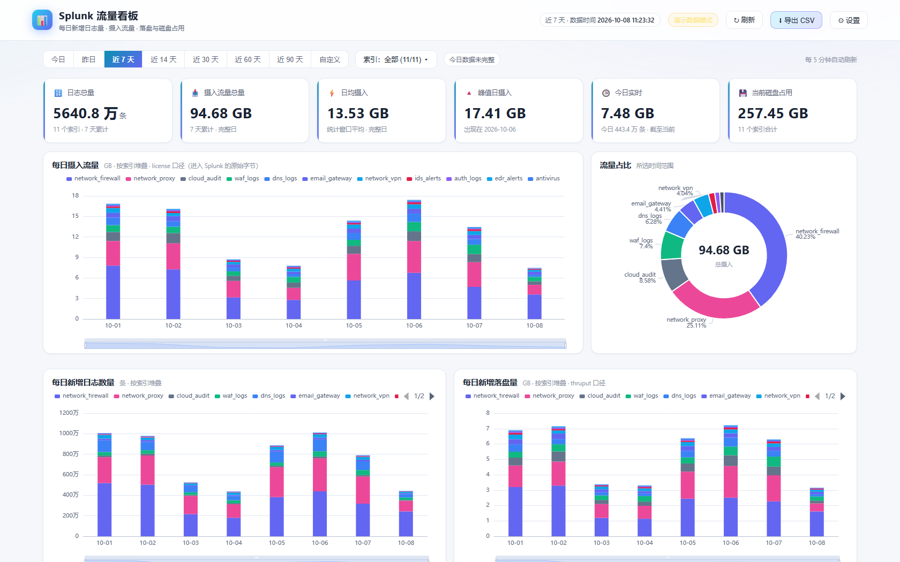
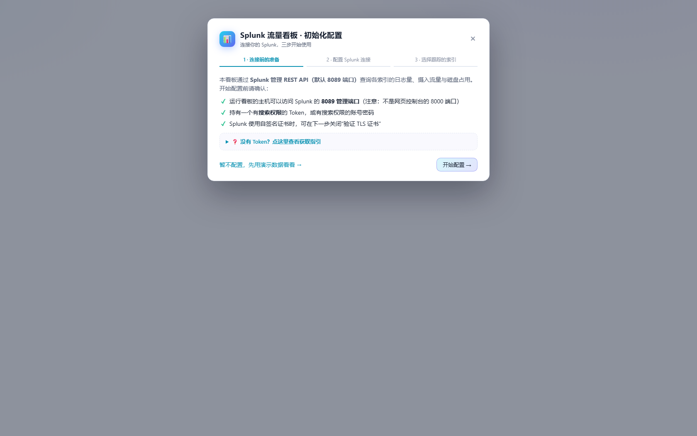
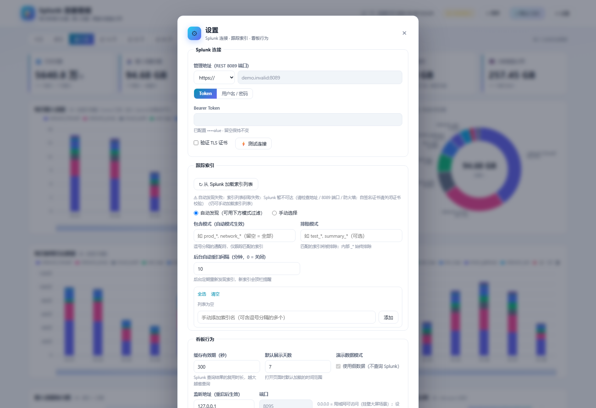

# Splunk 流量看板（splunk-traffic-dashboard）

一个独立部署的 Splunk 流量统计看板：通过 Splunk 管理 REST API（8089 端口）查询各索引的每日
**日志量、摄入流量（license 口径）、落盘量与磁盘占用**，用 ECharts 展示成可挂壁的大屏页面。
首次访问自带**初始化配置向导**，连 Splunk 都不用碰命令行；之后随时点右上角 **⚙ 设置** 修改连接。



## 功能

- **每日摄入流量**（license_usage 原始字节，计费口径）、**每日日志数**、**每日落盘量**、**当前磁盘占用**（dbinspect）
- 6 个 KPI 卡片、堆叠柱图、流量占比环形图、索引 × 日期热力图、磁盘占用条形图
- 各索引汇总表 / 每日明细表，列头可排序，支持 CSV 导出（导出遵循当前筛选）
- 时间范围：今日 / 昨日 / 7~90 天 / 自定义（默认天数可在设置中修改）；索引多选筛选；每 5 分钟自动刷新
- 查询期间全屏加载动画，实时显示当前查询步骤（事件数 / 摄入流量 / 落盘 / 磁盘 / 记录范围）与覆盖日期
- **索引自动发现**：后台定期重扫 Splunk，新索引自动纳入统计（自动模式）或顶栏 🆕 提醒一键跟踪（手动模式），支持包含/排除通配模式（如只统计 `prod_*`）
- 查询结果本地缓存（默认 300s），挂壁页面秒开；Splunk 暂不可达时回退上次缓存并提示
- **未配置 Splunk 时自动进入演示数据模式**，可以先用假数据体验全部 UI

## 快速开始

要求：Python 3.10+，一台能访问 Splunk 8089 管理端口的主机。

```bash
git clone https://github.com/muzian666/splunk-traffic-dashboard.git
cd splunk-traffic-dashboard

python -m venv .venv
# Windows:
.venv\Scripts\pip install -r requirements.txt
# Linux/macOS:
# .venv/bin/pip install -r requirements.txt

# 启动（Windows 也可直接双击 start_dashboard.bat）
.venv\Scripts\python -m traffic_dashboard.server     # Windows
# .venv/bin/python -m traffic_dashboard.server       # Linux/macOS（或 ./run.sh）
```

打开 <http://127.0.0.1:8091>，按向导配置即可。

## 首次配置向导（初始化）

首次打开且尚未配置连接时，页面会自动弹出三步向导：



1. **连接前的准备** —— 内置 Token 获取指引（Splunk Web → 设置 → TOKEN 新建令牌；或 `curl` 调用
   `/services/authorization/tokens` 创建），以及 8089 / 8000 端口、自签名证书等注意事项。
2. **配置 Splunk 连接** —— 填管理地址（如 `https://10.0.0.8:8089`），选择 **Token（推荐）** 或
   **用户名/密码** 认证，点「⚡ 测试连接」实时验证，成功会显示 Splunk 版本与主机名。
3. **选择跟踪的索引** —— 一键从 Splunk 拉取索引列表勾选；也可以选「全部非内部索引」自动跟踪，
   或手动输入索引名。

保存后立即生效，无需重启。凭据只写入本机 `config.json`（已被 `.gitignore` 忽略）。

> 想先看看效果？向导第一步点「暂不配置，先用演示数据看看」即可用假数据体验全部功能。

## 设置页面

主界面右上角 **⚙ 设置** 可随时修改：



- **Splunk 连接**：地址 / Token 或账号密码 / TLS 证书校验，保存前可先「测试连接」
- **跟踪索引**：重新拉取索引列表勾选、手动增删、自动/手动模式切换、包含/排除通配模式、后台重扫间隔，新索引可一键跟踪
- **看板行为**：查询缓存时长（秒）、默认展示天数、演示数据模式、监听地址与端口（重启后生效）

保存即时生效（监听地址/端口除外，需重启进程）。

### 索引自动发现

跟踪索引有两种模式（⚙ 设置中切换）：

- **自动发现**：跟踪凭据可见的全部非内部索引（`_*` 永远排除），可用**包含/排除通配模式**过滤，
  例如包含 `prod_*`、排除 `test_*, summary_*`。后台默认每 10 分钟重扫一次，Splunk 新建的索引
  会自动纳入统计，无需任何操作。
- **手动选择**：只统计勾选的索引。后台重扫依旧运行，新索引不会自动加入，但看板顶栏会出现
  🆕 提醒，点击进入设置可「一键跟踪全部新索引」。

状态行会显示：上次发现时间、凭据可见的索引数、当前跟踪数与新索引数。

## 配置说明

配置有三层，**右侧优先**：`内置默认值` ← `.env` / 系统环境变量 ← `config.json`（网页端保存）。

| 项目 | 环境变量 | 默认 | 说明 |
|---|---|---|---|
| Splunk 管理地址 | `SPLUNK_API_URL` | 空 | 如 `https://splunk.example.com:8089` |
| Bearer Token | `SPLUNK_TOKEN` | 空 | 与用户名密码二选一，推荐 Token |
| 用户名 / 密码 | `SPLUNK_USERNAME` / `SPLUNK_PASSWORD` | 空 | Basic 认证方式 |
| 验证 TLS 证书 | `SPLUNK_VERIFY_CERTS` | `false` | 自签名证书保持 `false` |
| 监听地址 | `DASHBOARD_HOST` | `127.0.0.1` | `0.0.0.0` = 局域网可访问（大屏场景） |
| 端口 | `DASHBOARD_PORT` | `8091` | 修改后需重启 |
| 缓存秒数 | `DASHBOARD_CACHE_TTL` | `300` | 30 ~ 86400 |
| 默认展示天数 | `DASHBOARD_DEFAULT_DAYS` | `7` | 打开页面时加载的时间范围，1 ~ 365 |
| 演示模式 | `DASHBOARD_MOCK` | `0` | `1` = 用假数据，不查 Splunk |
| 跟踪索引 | `TRAFFIC_INDEXES` | 空 | JSON 数组；空 = 自动发现模式 |
| 包含模式 | `TRAFFIC_INDEX_INCLUDE` | 空 | JSON 数组，通配符；自动模式下生效 |
| 排除模式 | `TRAFFIC_INDEX_EXCLUDE` | 空 | JSON 数组，通配符；内部 `_*` 始终排除 |
| 索引重扫间隔 | `INDEX_RESCAN_MINUTES` | `10` | 分钟；`0` = 关闭后台重扫/新索引检测 |

通过 `.env` / 环境变量设置的项会在设置页中显示为**只读**（带提示），避免“页面改了却不生效”的困惑；
完全用网页管理配置的话，不需要创建 `.env`（参考 `.env.example`）。

### API 一览

| 端点 | 说明 |
|---|---|
| `GET /api/data?from=<epoch>&to=<epoch>` | 看板数据集（自动缓存） |
| `GET /api/config` / `POST /api/config` | 读取（脱敏）/ 保存配置 |
| `POST /api/config/test` | 测试连接（可携带未保存的凭据） |
| `POST /api/indexes/discover` | 发现可跟踪的索引列表 |
| `GET /api/indexes/status` | 索引自动发现状态（跟踪/可见/新出现） |
| `GET /api/health` | 健康状态 |

## 统计口径

- **摄入流量** = `license_usage` 原始字节数（进入 Splunk 的数据量，按流量计费建议以此为准，不含压缩）
- **落盘量** = `metrics` 的 `per_index_thruput`（解析后写入索引的数据量）
- **磁盘占用** = `dbinspect sizeOnDisk`（压缩后实际占用，含历史累积）

三者数值依次递减属正常现象。历史深度受 `_internal` 索引保留期限制。

## 安全注意事项

- 凭据保存在本机 `config.json`，确保该文件与仓库目录的访问权限受控（已默认 `.gitignore`）
- 服务默认只监听 `127.0.0.1`；设置界面**没有登录鉴权**，如需挂壁大屏开放到局域网
  （`DASHBOARD_HOST=0.0.0.0`），请放在受信任网段或用防火墙/反向代理加访问控制
- 建议为看板创建只读、仅授权目标索引的专用 Token，不要使用管理员账号

## 常见问题

- **测试连接报 401**：Token 无效或过期；账号密码错误。重新生成 Token 或检查账号。
- **无法连接 / 超时**：确认用的是 **8089 管理端口**而不是 8000；看板主机到 Splunk 的网络/防火墙放行。
- **TLS 证书错误**：自签名证书请关闭「验证 TLS 证书」，或将 Splunk CA 导入系统信任库。
- **索引列表为空**：Token 权限看不到任何索引，请让 Splunk 管理员为该角色授权目标索引的读取权限。
- **数据为 0**：`license_usage` / `per_index_thruput` 来自 `_internal`，超岀保留期的历史查不到。

## License

[MIT](LICENSE)
